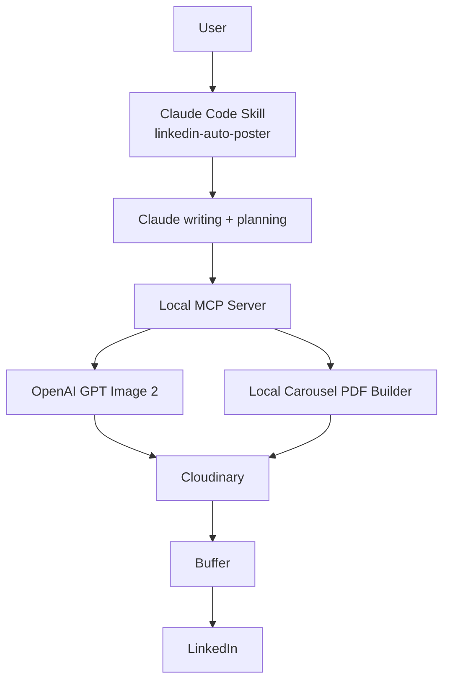

# Architecture

## High-level system



## Responsibility boundaries

### Claude skill
- content strategy
- LinkedIn copywriting
- hook/body/CTA drafting
- slide-by-slide creative brief
- user-facing review and approval
- orchestration decisions

### MCP server
- credentialed API calls
- deterministic asset processing
- provider validation/error normalization
- Buffer draft/queue/schedule operations
- storage/upload operations

### OpenAI GPT Image 2
- visual generation and editing
- optional use of reference imagery for brand consistency

### Cloudinary
- durable creative storage
- public HTTPS delivery URLs consumed by Buffer
- logical folders/tags per post
- PDF and thumbnail hosting

### Buffer
- post drafts
- queue and custom scheduling
- multiple-post inventory
- final delivery to LinkedIn

## Workflow states

```text
idea
  -> drafted
  -> creative_planned
  -> assets_generated
  -> assets_hosted
  -> buffer_draft
  -> approved
  -> queued | scheduled
  -> sent
```

The system must not skip from `buffer_draft` to `queued` or `scheduled` without explicit approval.

## Suggested IDs

Use a stable local workflow ID for correlation:

```text
YYYYMMDD-topic-short-slug-random4
```

Store this in Cloudinary tags/context and in local logs/metadata where possible.

## Asset layout in Cloudinary

```text
linkedin-content-engine/
  <workflow-id>/
    slides/
      01-cover.png
      02-problem.png
      ...
    carousel/
      <slug>.pdf
      <slug>-thumbnail.png
    single/
      hero.png
```

## Security model

- secrets only via environment variables;
- no secrets in skill markdown, samples, logs, or tool results;
- validate remote URLs before handing them to Buffer;
- use HTTPS URLs only;
- no browser automation against LinkedIn;
- no automatic publishing from a drafting request;
- providers should be called server-side only.
